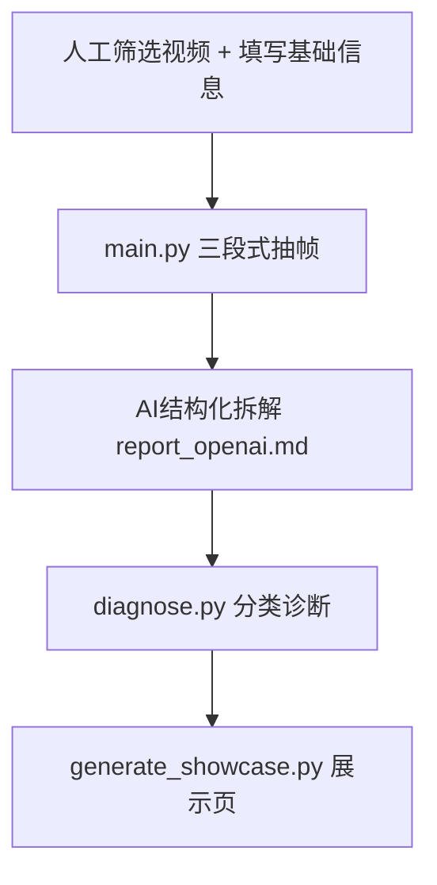

# ViralScope AI

## Problem

爆款拆解长期依赖人工复盘，效率低，判断标准也不统一。

高播放低转化和双低视频难以快速定位问题，双低案例又占复盘大头，持续消耗达人样品预算和复盘时间；同时，团队也很难把爆款经验稳定复刻到脚本、品牌账号或渠道号达人账号。

## Solution

ViralScope AI 是一个本地 AI 复盘 workflow：人工筛选值得分析的视频样本，脚本自动抽帧、生成 AI 结构化拆解，并基于播放量与订单转化率做转化诊断分类判断；AI辅助判断、不替代筛选。

## Architecture



## Demo

GitHub Pages: https://allilady.github.io/viral-scope-ai/

| Demo | 类型说明 | 链接 |
|---|---|---|
| video1 | B 类：高播放低转化，适合定位信任、卖点和行动引导断点。 | https://allilady.github.io/viral-scope-ai/video1/showcase.html |
| video2 | A 类：高播放高转化，适合提炼可复用的带货内容结构。 | https://allilady.github.io/viral-scope-ai/video2/showcase.html |
| video3 | C 类：低播放但转化尚可，适合分析垂类达人和精准人群匹配。 | https://allilady.github.io/viral-scope-ai/video3/showcase.html |
| video4 | D 类：双低，适合定位达人匹配、内容信任和卖点表达问题。 | https://allilady.github.io/viral-scope-ai/video4/showcase.html |

## Results

| 指标 | 结果 |
|---|---|
| 已验证案例数 | 4 条 |
| 单条处理耗时 | 30 秒左右的视频约 120 秒；更长视频会随抽帧数量和 API 响应时间增加 |
| 输出内容 | 英文 AI 拆解报告、英文转化诊断、GitHub Pages 展示页 |

分类诊断使用订单转化率 `orders / views` 作为核心口径：`0.05%` 为行业及格线，`0.1%` 为优秀线，`0.3%` 以上为爆款/神仙线。

| Case | 实测分类 | 转化率档位 |
|---|---|---|
| video1 | B 类：高播放低转化 | 0.000%，below passing |
| video2 | A 类：高播放高转化 | 0.098%，passing |
| video3 | C 类：低播放但转化尚可 | 0.091%，passing |
| video4 | D 类：双低 | 0.000%，below passing |

## Tech Stack

| 模块 | 技术 |
|---|---|
| Runtime | Python |
| AI 调用 | OpenAI-compatible Chat Completions API |
| 视频抽帧 | ffmpeg / ffprobe |
| HTTP 请求 | requests |
| 展示页 | Static HTML / CSS |
| 在线发布 | GitHub Pages (`docs/`) |

## Setup

```bash
pip install -r requirements.txt        # 依赖：requests
cp config.example.json config.json     # 按需改成你的 OpenAI-compatible 中转地址
export OPENAI_API_KEY=sk-...            # Windows PowerShell: $env:OPENAI_API_KEY="sk-..."
```

系统需要 `ffmpeg` / `ffprobe`（优先用 PATH 里的；Windows 下也可回退到 `ffmpeg-bin/` 本地构建）。

## Run

```bash
python main.py <video_name>                # 抽帧 + 时间轴 + AI 拆解
python diagnose.py <video_name>            # 转化诊断
python generate_showcase.py <video_name>   # 生成展示页
```

`<video_name>` 对应 `samples/<video_name>.mp4` 和 `samples/<video_name>.json`。

## Outputs

| 文件 | 说明 |
|---|---|
| `outputs/<name>/frames/` | 三段式抽帧截图 |
| `outputs/<name>/ViralScope_report.md` | 本地基础时间轴报告（不依赖 AI） |
| `outputs/<name>/report_openai.md` | AI 爆款拆解报告 |
| `outputs/<name>/diagnosis.md` | 转化诊断报告 |
| `outputs/<name>/showcase.html` | 汇总展示页 |

`outputs/` 为生成产物，不纳入版本控制。

## GitHub Pages Update

更新在线展示页时，先重跑脚本，再把 `outputs/<name>/showcase.html` 和页面引用的 `frames/*.jpg` 同步到 `docs/<name>/`，随后提交并推送。
